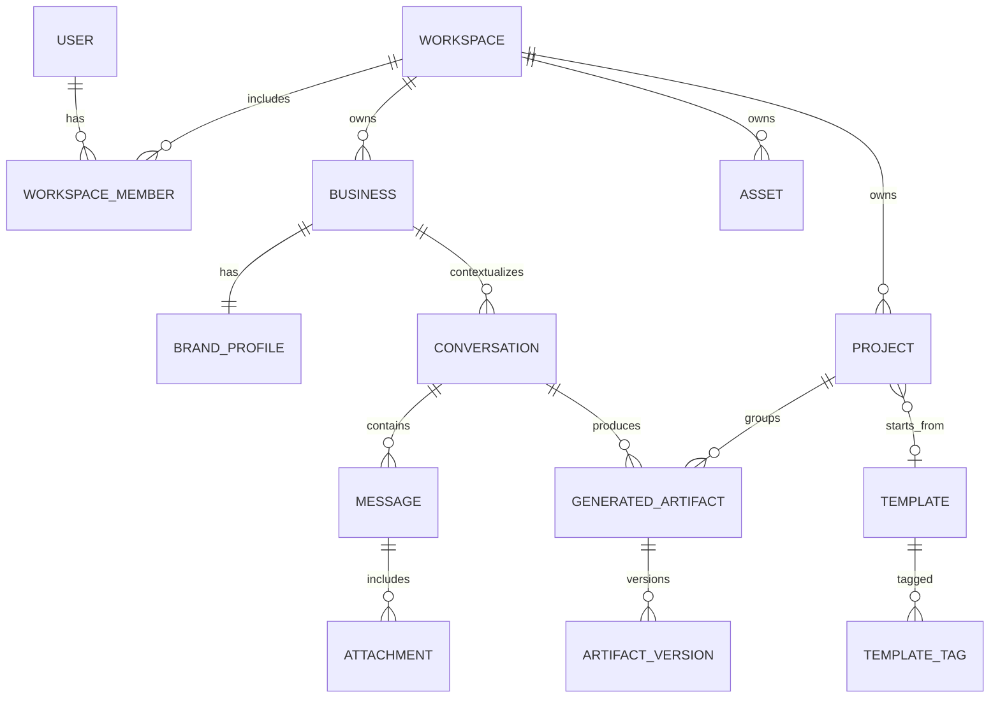

# Data model

## Core relationships

## Important entities

### Business

- id
- workspace_id
- name
- category
- country
- city
- description
- primary_product
- target_audience
- preferred_platforms
- primary_objective
- created_at
- updated_at

### BrandProfile

- id
- business_id
- voice_tones
- primary_color
- secondary_color
- logo_asset_id
- preferred_words
- forbidden_words
- value_proposition
- version

### Conversation

- id
- workspace_id
- business_id
- title
- status
- created_by
- created_at
- updated_at

### Message

- id
- conversation_id
- role
- content
- intent
- metadata_json
- created_at

Store only user-visible assistant content, not private model reasoning.

### GeneratedArtifact

- id
- conversation_id
- project_id nullable
- artifact_type
- platform
- objective
- active_version_id
- model_provider
- model_name
- prompt_version
- business_profile_version
- created_at

### ArtifactVersion

- id
- artifact_id
- version_number
- content_json
- user_edited
- parent_version_id nullable
- created_at

### Asset

- id
- workspace_id
- object_key
- media_type
- mime_type
- size_bytes
- width
- height
- checksum
- status
- created_at

## Retention

- Soft-delete user content first.
- Define a recovery window for projects.
- Provider request logs should retain metadata, not full sensitive payloads by default.
- User deletion must cascade or anonymize all workspace-owned records according to policy.
