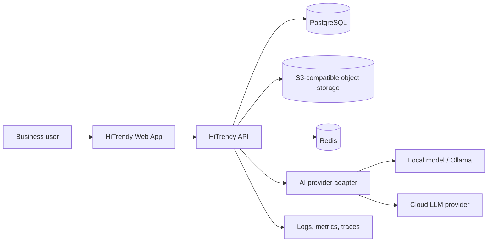

# System context

## Context diagram



## Architectural style

- Modular monolith for the MVP.
- Clear bounded contexts and adapter interfaces.
- HTTP API between web and backend.
- Background jobs only for slow or retryable work.
- Structured AI outputs validated at the boundary.
- Provider independence.
- Demo mode as a first-class adapter.

## Why a modular monolith

The project is small enough that microservices would add deployment and debugging cost without providing meaningful scale benefits. Domain boundaries are maintained in code so individual capabilities can be extracted later if necessary.

## Major modules

1. Identity and workspace.
2. Business and brand profile.
3. Conversation.
4. Generation.
5. Templates.
6. Projects and library.
7. Analytics and feedback.

## Request path

```text
Browser
  -> route handler / API client
  -> FastAPI endpoint
  -> application service
  -> domain policy
  -> repository and provider ports
  -> adapters
  -> validated response DTO
```

## AI generation path

```text
User request
  -> intent classification
  -> context resolution
  -> prompt assembly
  -> provider call
  -> schema validation
  -> quality checks
  -> persistence
  -> artifact response
```

## Deployment units

- `web`: Next.js application.
- `api`: FastAPI application.
- `worker`: optional job runner using the same application code.
- PostgreSQL.
- Redis.
- S3-compatible storage.

## Scalability approach

- Keep API stateless.
- Store conversation and generation state in PostgreSQL.
- Cache template catalogs and business summaries.
- Move vision or large-generation requests to jobs when latency requires it.
- Use provider-level concurrency and rate limits.
