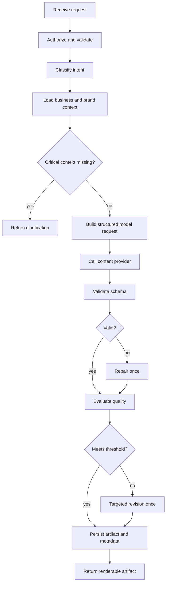

# AI orchestration

## MVP recommendation

Start with a deterministic workflow, not an unconstrained autonomous agent. A graph runtime may be used when it improves retries, persistence, or branching.

## Generation state

```python
class GenerationState(TypedDict):
    request_id: str
    workspace_id: str
    business_id: str
    conversation_id: str
    user_text: str
    intent: str | None
    missing_fields: list[str]
    business_context: dict
    attachment_context: list[dict]
    model_request: dict
    raw_output: dict | None
    validated_artifact: dict | None
    evaluation: dict | None
    retry_count: int
    error: str | None
```

## Workflow



## Why not a free-form agent

A free-form agent can make unnecessary tool calls, increase latency, and behave inconsistently. HiTrendy has a small set of predictable capabilities, so the application should own the flow.

## LangGraph integration point

Use LangGraph when adding:

- resumable jobs,
- human approval,
- parallel image and copy analysis,
- provider fallbacks,
- multi-step campaign generation.

The graph should call application services. It should not become the domain model.

## Context budget

Include only:

- normalized business summary,
- relevant brand rules,
- current user request,
- last few relevant messages or a conversation summary,
- selected asset analysis,
- output schema instructions.

Do not send the entire user history by default.

## Retry policy

- Network/provider retry: up to two with backoff.
- Schema repair: one.
- Quality revision: one.
- Never silently loop indefinitely.
